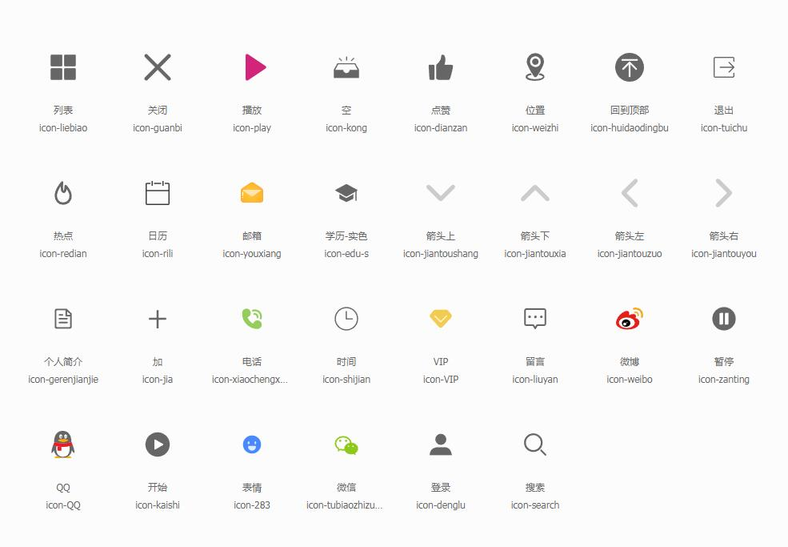

# pager组件

```javascript
<Pager :current="current" :total="330" :visibleNumber='5' @pageChange="handlePageChange" />
```
## 属性

| 属性名        | 含义       | 类型   | 必填 | 默认值 |
| ------------- | ---------- | ------ | ---- | ------ |
| current       | 当前页码   | Number | 否   | 1      |
| total         | 总数据量   | Number | 否   | 0      |
| limit         | 页容量     | Number | 否   | 10     |
| visibleNumber | 可见页码数 | Number | 否   | 10     |

## 事件

| 事件名     | 含义     | 事件参数 | 参数类型 |
| ---------- | -------- | -------- | -------- |
| pageChange | 页码变化 | 新的页码 | Number   |

```javascript
//事件处理函数
    handlePageChange(newPage) {
      this.current = newPage;
      
    },
```

# Icon组件
- 如果设置图标大小：
 在Icon组件父元素中设置font-size: 16px;
```javascript
<Icon :iconType="QQ"  />
```
## 属性

| 属性名        | 含义       | 类型   | 必填 | 默认值 |
| ------------- | ---------- | ------ | ---- | ------ |
| iconType      |  图标自定义名字   | String | 是   | 无      |




### 自定义iconType类型
| iconType类型  | 图标名称      | 
| ------------- | ---------- | 
|home|首页|
| liebiao    |  列表  | 
| close   |  关闭  | 
| play    |  播放 | 
| empty   |  空  | 
| zan   |  点赞 | 
|  location    |  位置  | 
| top    |  回到顶部  | 
|  hot   | 热点  | 
| calendar    |  日历  | 
|  email |邮箱  | 
|  edu | 学历 | 
|arrowUp|上箭头|
|arrowDown|下箭头|
|arrowLeft|左箭头|
|arrowRight|右箭|
|profile|个人简|
|ad|加号|
|tel|电话|
|time|时间|
|vip|vip|
|message|留言|
|web|微博|
|stop|暂停|
|QQ|QQ|
|start|开始|
|biaoqing|表情|
|chat|微信|
|login|登录|
|search|搜索|

<!-- 需要将下面JS代写入组件 -->
```javascript
const const iconMap={
  home:'#icon-shouye',//首页
    liebiao:'#icon-liebiao',//列表
    close:'#icon-guanbi',//关闭
    play:'#icon-play',//播放
    empty:'#icon-kong',//空
    zan:'#icon-dianzan',//点赞
    location:'#icon-weizhi',//位置
    top:'#icon-huidaodingbu',//回到顶部
    exit:'#icon-tuichu',//退出
    hot:'#icon-redian',//热点
    calendar:'#icon-rili',//日历
    email:'#icon-youxiang',//邮箱
    edu:'#icon-edu-s',//学历
    arrowUp:'#icon-jiantoushang',//上箭头
    arrowDown:'#icon-jiantouxia',//下箭头
    arrowLeft:'#icon-jiantouzuo',//左箭头
    arrowRight:'#icon-jiantouyou',//右箭头
    profile:'#icon-gerenjianjie',//个人简介
    ad:'#icon-jia',//加号
    tel:'#icon-xiaochengxu_tubiao',//电话
    time:'#icon-shijian',//时间
    vip:'#icon-VIP',//vip
    message:'#i#con-liuyan',//留言

    web:'#icon-weibo',//微博
    stop:'#icon-zanting',//暂停
    QQ:'#icon-QQ',//QQ
    start:'#icon-kaishi',//开始
    biaoqing:'#icon-283',//表情
    chat:'#icon-tubiaozhizuomoban',//微信
    login:'#icon-denglu',//登录
   search:'#icon-search',//搜索


}
 
```

# Avatar组件
```javascript
<Icon :url="url"  :imgSize='50' />
```
## 属性

| 属性名        | 含义       | 类型   | 必填 | 默认值 |
| ------------- | ---------- | ------ | ---- | ------ |
| url       | 图片链接地址   | String | 否   | 1      |
| imgSize        | 头像的尺寸   | Number | 否   | 150     |

# Empty组件 
直接使用，没有其他属性

```javascript
 <Empty  text='无数据' />
```
## 属性

| 属性名        | 含义       | 类型   | 必填 | 默认值 |
| ------------- | ---------- | ------ | ---- | ------ |
| text      | 显示的内容   | String | 否   | 空空如也     |

# ImgLoader组件

```javascript
   <ImgLoader :duration='1000' src='url' placeholder=' placeholderurl' @load="load"/>
```
## 属性

| 属性名        | 含义       | 类型   | 必填 | 默认值 |
| ------------- | ---------- | ------ | ---- | ------ |
| duration       | 图片加载过渡时间  | Number | 否   | 1000      |
| placeholder      | 站位图链接地址    | String| 是   | 无      |
| src      | 原图链接地址    | String | 是   |  无     |


## 事件

| 事件名     | 含义     | 事件参数 | 参数类型 |
| ---------- | -------- | -------- | -------- |
| load | 原图加载完成后加载 | 无 | 无   |

```javascript
//事件处理函数
    load(){
      console.log('图片加载完成')
    }
```